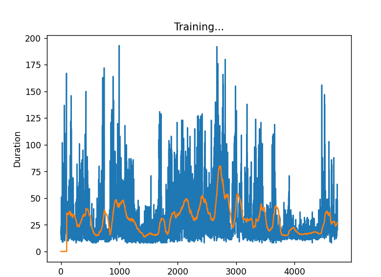

# 130 项目

## Resources

[openAI Mario Environment](https://pypi.org/project/gym-super-mario-bros/)

[DeepLearning FlappyBird DQN](https://github.com/yenchenlin/DeepLearningFlappyBird)

[RL tutorial](https://github.com/MorvanZhou/Reinforcement-learning-with-tensorflow)

[Mario DQN](https://github.com/aleju/mario-ai)

[Deep Q](https://blog.paperspace.com/building-double-deep-q-network-super-mario-bros/)

[NN](https://www.youtube.com/watch?v=BGeTG1M632U)

[RL](https://www.statworx.com/at/blog/using-reinforcement-learning-to-play-super-mario-bros-on-nes-using-tensorflow/)

[RL](https://cai.tools.sap/blog/the-future-with-reinforcement-learning-part-1/)

[pytorch](https://pytorch.org/tutorials/intermediate/mario_rl_tutorial.html)

[DDQN](https://blog.paperspace.com/building-double-deep-q-network-super-mario-bros/)

# Process
- [ ] 如何部署在 Amazon/Google 上


- [x] 什么是 Q learning
- [ ] 如何让 Mario 看到图
- [ ] 回馈
- [ ] 哈?


# 算法
[Q learning Wikipedia](https://en.wikipedia.org/wiki/Q-learning)

## epsilon-Greedy

贪婪算法的一种

单纯的贪婪算法只能出一两个最佳选择, (局部最优) 不适用于有动态敌人的 N 步游戏


```e Greedy```

按一定概率去选择局部最优还是尝试另外的方法


```保留, 可遇到所有敌人都避过去```


### Q table

---

更新逻辑


## Code helper 

Pytorch.squeeze(x)

移除 x 中张量为 1 的 列


random.sample(x,size)

从 x 里找 size 个


# 演讲

感谢上一个演讲 Markov-Decision, optimal policy

展示效果

[open AI](https://gym.openai.com/envs/CartPole-v0/)

[Torch](https://pytorch.org/tutorials/intermediate/reinforcement_q_learning.html)

CNN convolutional -neural network


  - neural network

  

  

  需要人监督 输出概率值

  [MNIST](http://yann.lecun.com/exdb/mnist/)

  - convolutional 
    - 用了卷积核去找其中一组 234 的关系.

  结果是这图某一个地方动了对 reward 有影响

  - 出了什么值给 Qlearning
  - 

- Q learning
  $$
  Q^*: State \times Action \rightarrow \mathbb{R}
  $$
  
- 
  - 根据状态和行为产生预测收益


Reward take from prevoius experience, recent experience make bigger effect.

discount :$\gamma$
$$
R_{t_0} = \sum_{t=t_0}^{\infty} \gamma^{t - t_0} r_t
$$


The $\pi$ fuction get best rewards from Learnig exprience

in this state this action get best result
$$
\pi^*(s) = \arg\!\max_a \ Q^*(s, a)
$$
new ```Q Value= Bellman```

$Q^\pi = reward+discount\cdot $ Best act for next state
$$
Q^{\pi}(s, a) = r + \gamma Q^{\pi}(s', \pi(s'))
$$


temporal difference:

the value need to make from current to best state
$$
\delta = Q(s, a) - (r + \gamma \max_a Q(s_{t+1}, a))
$$


$$
Q^{new}=Q(s_t,a_t)+\alpha\cdot (r_t+\gamma\cdot Q^{\pi} - Q(s_t,a_t))
$$


After Q learn from percitular State(image) and relation ship between action and result

i can update itself.